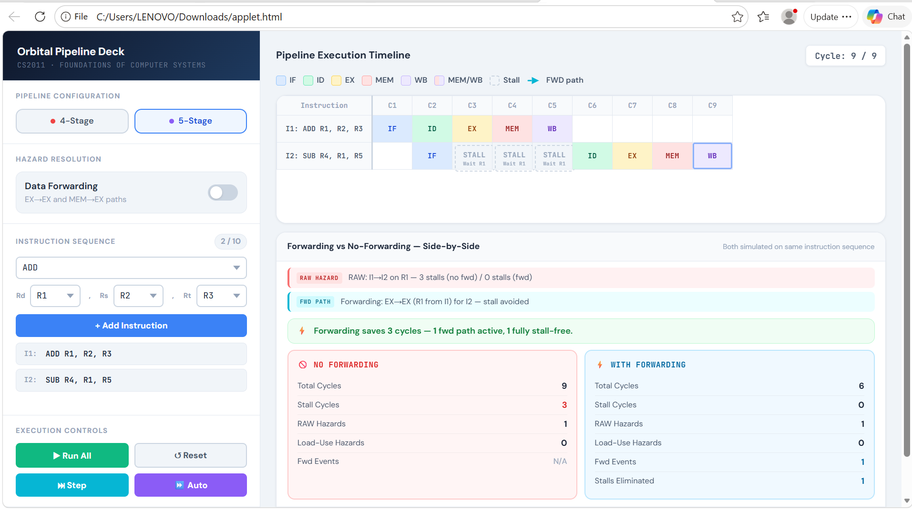

# 🛰️ Plaksha Orbital Pipeline Deck

> CS2011 — Foundations of Computer Systems · Assignment 2  
> **Kashika Kapoor · Jahnavi S · Vansh Jain**

A browser-based pipeline hazard simulator. Input instructions and watch them move cycle-by-cycle through a 4-stage or 5-stage pipeline, with RAW hazard detection, stall insertion, and data forwarding.

**[▶ Open Live Demo](https://Jahnavi292006.github.io/Focs-pipeline-simulator/applet.html)**

---

---

## Features

- **4-stage and 5-stage** pipeline modes
- **Supported instructions** — `ADD`, `SUB`, `MUL`, `DIV`, `AND`, `OR`, `ORI`, `LW`, `SW`, `SLT`
- **RAW hazard detection** with automatic stall insertion
- **Data forwarding** toggle — EX→EX and MEM→EX paths
- **Load-use hazard** handling — 1 stall inserted even with forwarding on
- **Side-by-side comparison** — total cycles, stall cycles, RAW hazards, forwarding events and stalls eliminated for both modes on the same instruction sequence
- **Step / Auto / Run All** execution controls
- Up to 10 instructions per simulation

---

## Files

| File | Description |
|---|---|
| `applet.html` | Open in any browser to run the simulator |
| `code.html` | Full source code — HTML + JavaScript + CSS |
| `FOCS_Report.pdf` | Detailed report — design, assumptions, test cases |

---

## Learn More

For the full explanation of the pipeline model, hazard handling, forwarding logic, and all test case analyses — see **[FOCS_Report.pdf](./FOCS_Report.pdf)**.
